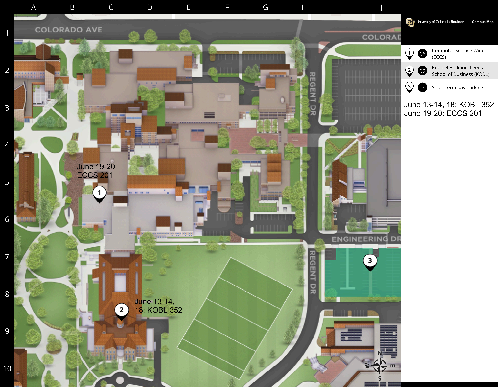

---
# Leave the homepage title empty to use the site title
title:
date: 2022-10-24
type: landing

sections:
  - block: newabout26
    # block: about.biography
    id: cfp
    content:
      title: Biography
      # Choose a user profile to display (a folder name within `content/authors/`)
      username: IWBDA-2026

  - block: people
    id: keynote
    content:
      title: Keynote Speakers
      user_groups:
      - 2026 Speakers

  - block: markdown
    id: submission
    content:
      title: Submission Guidelines
      text: |-
        Abstracts and workshop proposals must be submitted via [EasyChair](https://easychair.org/conferences?conf=iwbda26). Submissions cannot exceed two pages (excluding figures and tables). If you do not have an EasyChair account, please create one by following the instructions specified [here](https://easychair.org/help/account_creation).

        All abstracts must use the IWBDA template and must not exceed two pages excluding the figures and tables. The following versions of the template are available for use:
        - [Overleaf]( https://www.overleaf.com/read/wbdpqqpstxbg#02d65f.)
        - MS Word

        All abstracts will undergo a single-blind peer review process on EasyChair. The accepted abstracts will be invited to present their work as a poster or a talk at the conference.

        We encourage abstracts for posters and/or talks at IWBDA 2026 on ongoing research that may be submitted as a full journal paper later. We are currently in talks with ACS Synthetic Biology to set up a special issue on bio-design automation for such extended journal submissions. For the full CFP and the latest information, please visit: https://www.iwbdaconf.org
    design:
      columns: '2'

  - block: markdown
    id: registration
    content:
      title: Registration
      text: |-
            

              <iframe
                title="Ticketing powered by Zeffy"
                style="position:absolute; border:0; top:0; left:0; width:100%; height:100%;"
                src="https://www.zeffy.com/embed/ticketing/iwbda--2026"
                allowpaymentrequest
                allowtransparency="true">
              </iframe>
            

      #|-
          # <link rel="stylesheet" type="text/css" href="https://www.brownpapertickets.com/widget_v671.css" /> 

  Brown Paper Tickets Ticket Widget Loading...  <A HREF="https://www.brownpapertickets.com/event/6694087">Click Here</A> to visit the Brown Paper Tickets event page.
  
  
    design:
      columns: '2'

  - block: markdown
    id: agenda
    content:
      title: Agenda
      text: |-
          ## Saturday, June 13, 2026 - IWBDA Tutorials. Location: KOBL 352
          - **08:30-10:00** Session 1
          - **10:00-10:30** Break
          - **10:30-12:00** Session 2
          - **12:00-13:30** Lunch Break
          - **13:30-15:00** Session 3 
          - **15:00-15:30** Break
          - **15:30-17:00** Session 4 

          ## Sunday, June 14, 2026 - IWBDA Tutorials. Location: KOBL 352
          - **08:30-10:00** Session 5 
          - **10:00-10:30** Break
          - **10:30-12:00** Session 6
          - **12:00-12:30** End

          ## Thursday, June 18, 2026 - IWBDA Workshop. Location: KOBL 352
          - **16:00-17:30** Panel Session 
          - **17:30** Reception

          ## Friday, June 19, 2026 - IWBDA Workshop. Location: ECCS 201
          - **08:30-09:00** Breakfast
          - **09:00-10:00** Invited Speaker
          - **10:00-10:30** Coffee Break
          - **10:30-12:00** Session 1
          - **12:00-13:00** Lunch
          - **13:00-14:30** Session 2
          - **14:30-15:00** Coffee Break
          - **15:00-16:00** Nona talks 
          - **16:00-17:00** DevCell Discussion

          ## Saturday, June 20, 2026 - IWBDA Workshop. Location: ECCS 201
          - **08:30-09:00** Breakfast
          - **09:00-10:00** Invited Speaker
          - **10:00-10:30** Coffee Break
          - **10:30-12:00** Session 3
          - **12:00-13:00** Lunch
          - **13:00-14:30** Session 4
          - **14:30-15:00** Coffee Break
          - **15:00-16:30** Session 5
          - **16:30-17:00** Closing Remarks

  - block: markdown
    id: parking
    content:
      title: Conference Venue
      text: |-
          
          

            
          

          

            Visitors to campus may park in hourly pay-to-park lots located throughout campus.
            Campus pay-to-park lot locations are included on the CU Boulder
            <a href="https://www.colorado.edu/map/?id=336#!ce/2739?ct/20989,20990,20991,20992,20993,20994,26118,2739?mc/40.00563459437513,-105.2595376968384?z/16?lvl/0">
            campus interactive map</a>.
          

  #   

  - block: people
    id: organizing
    content:
      title: Organizing Committee
      user_groups:
      - Bio Innovation Week 2026
  
  # - block: people
  #   id: program
  #   content:
  #     title: Program Committee
  #     user_groups:
  #     - Bio Innovation Week 2026 program
  
  - block: markdown
    id: agenda
    content:
      title: Program Committee
      text: |
          - [Lukas Bücherl](https://engineering.usu.edu/be/people/faculty/buecherl-lukas) Utah State University
          - [David J. Ross (Fed)](https://www.nist.gov/people/david-j-ross) NIST
          - [Aaron Adler](https://www.linkedin.com/in/adadler/) BBN
          - [Martín Gutiérrez](https://servicios.urjc.es/pdi/ver/martin.gutierrez) Universidad Rey Juan Carlos
          - [Caleb Bashor](https://profiles.rice.edu/faculty/caleb-bashor) Rice University
          - [Zhen Zhang](https://engineering.usu.edu/ece/people/faculty/zhang-zhen) Utah State University
          - [Harrison Steel](https://eng.ox.ac.uk/people/harrison-steel) University of Oxford
          - [Daisuke Kiga](https://kigalab.w.waseda.jp/) Waseda University
          - [Jake Beal](https://www.linkedin.com/in/jake-beal/) BBN
          - [Tae Seok Moon](https://www.jcvi.org/about/tae-seok-moon) J. Craig Venter Institute
          - [Eric Young](https://www.wpi.edu/people/faculty/emyoung) Worcester Polytechnic Institut (WPI)
          - [William Mo](https://geneticlogiclab.org/author/william-mo/) CU Boulder
          - [Carolus Vitalis](https://geneticlogiclab.org/author/carolus-vitalis/) CU Boulder
  
  - block: contact
    id: contact
    content:
      title: Contact Us
      text: |-
        Interested in participating, organizing, or sponsoring IWBDA or Bio Innovation Week? Reach out to us for more information on how you can get involved in IWBDA, IWBMA, the Nona Works Hackathon, or SBOL Workshops. We look forward to hearing from you!
      email: bio.design.automation.inc@gmail.com
---
